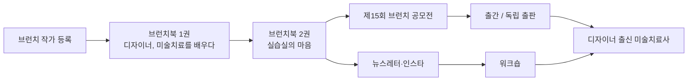

# 브런치 작가 데뷔 로드맵 — 디자이너, 미술치료를 배우다

## 1. 큰 그림: 브랜드 한 문장과 3년 로드맵

브랜드 문장은 3년간 바뀌지 않습니다. "이미지를 만들던 사람이, 이미지로 마음을 돌보는 사람이 되어가는 기록." 브런치는 미술치료사 데뷔 전에 신뢰를 먼저 쌓아두는 통장입니다.

| 시기 | 정체성 | 목표 | 핵심 활동 |
| --- | --- | --- | --- |
| 1년차 (2026.9 ~ 2027.9) | 배우는 사람 | 작가 등록, 브런치북 1권 완성, 구독자 300~500명 | 주 1회 발행, 독자와 같은 눈높이, 표지 톤 확립 |
| 2년차 (2027.9 ~ 2028.9) | 실습하는 사람 | 브런치북 2~3권, 구독자 1,500명 내외, 제15회 브런치 공모전 응모 | 현장 감각 반영, 인스타·뉴스레터 개설 |
| 3년차 (2028.9 ~ 2029.9) | 자기 방법론이 있는 치료사 | 출간 제안 또는 독립 출판, 워크숍·강의 첫 시도 | 자격 취득, 독자를 첫 고객층으로 전환 |

글이 자산이 되고, 자산이 독자가 되고, 독자가 고객이 되는 순서입니다.

## 2. 운영 체크리스트

주 1회를 1년 지키는 것이 주 3회 두 달보다 낫습니다. 아래 항목을 순서대로 확인하세요.

**작가 신청 전**

- [ ] 필명 확정 (실명 또는 나중에 실명과 연결 가능한 필명)
- [ ] 소개글 작성 (섹션 3 초안 활용)
- [ ] 1권 1~3화 저장글 작성 — 서로 다른 소재가 아니라 한 시리즈의 연속
- [ ] 첫 글은 이론이 아닌 자기소개형 에세이 "왜 디자이너가 밤에 미술치료를 배우는가"
- [ ] 신청서 계획 항목: 대상 독자·소재·주기를 3~4문장으로 (예: "미술치료를 배우는 디자이너로서 이론을 일상 언어로 풀고, 실습에서 느낀 마음을 주 1회 기록")
- [ ] 표지 이미지 톤 결정 (종이 질감, 낮은 채도 등 한 가지로 통일)

**발행 리듬**

- [ ] 요일·시간 고정 (예: 매주 일요일 밤 9시)
- [ ] 발행 전 비축분 2편 유지
- [ ] 글 길이 공백 포함 2,000~3,500자 (이론 글은 짧게, 성찰 글은 길게)
- [ ] 브런치북 목차를 먼저 짜고 그 안에서 발행

**한 편의 구조 (매 글 점검)**

1. 장면으로 시작 — 회의실, 실습실, 내 책상 위의 그림 (3~5문장)
2. 그 장면이 건드린 감정 하나
3. 이론 투입 — 전체의 30% 이하, 용어는 한 번만 쓰고 바로 풀어씀
4. 이론으로 장면을 다시 읽기 — 글의 심장
5. 독자에게 남기는 것 하나 — 질문 또는 오늘 밤 5분짜리 행동
6. 마지막 문장은 위로가 아닌 동행의 톤 ("저도 아직 그 그림 앞에 서 있어요")

**제목 공식**

| 유형 | 예시 | 피할 것 |
| --- | --- | --- |
| 구체적 장면형 | 회의 중 그린 낙서에 상사 얼굴이 있었다 | 투사 기법이란 |
| 고백형 | 나는 색을 고르는 게 무섭다 | 색채심리 입문 |
| 반전형 | 디자이너인데 그림이 두렵습니다 | 미술치료의 정의 |

**이미지**

- [ ] 표지는 내 그림 또는 직접 찍은 재료 사진으로 통일
- [ ] 본문 그림은 "잘 그린 그림"이 아닌 실습 때 그린 못난 그림

**독자 관리**

- [ ] 첫 100명은 손으로: 직장인 에세이·심리 분야 작가 글에 진심 어린 댓글
- [ ] 댓글 답변 24시간 이내
- [ ] '제안하기'는 열어두되 자격 전 "치료" 명칭 활동 제안은 거절

**윤리 가드레일 (필수)**

- [ ] 실습 내담자 묘사 없이 "그 시간 이후의 나"만 기록
- [ ] 소개글과 글 하단에 "학습 중인 대학원생의 기록이며 치료·진단이 아닙니다" 한 줄
- [ ] 회사명·동료 특정 금지
- [ ] 이론은 지도교수 눈으로 검토한다는 기준으로 정확성 확인

## 3. 소개글 초안과 필명

소개글은 "누구를 위해 무엇을 쓰는가"가 한 문장으로 읽혀야 합니다.

**한 줄 소개 (프로필 상단)**

> 이미지를 만들던 사람이, 이미지로 마음을 돌보는 사람이 되어가는 중.

**작가 소개 (150자 내외)**

> 낮에는 디자이너, 밤에는 미술치료를 공부하는 대학원생입니다. 이미지를 만드는 일을 하다가, 이미지가 사람을 돌보는 원리를 배우는 중입니다. 배운 것을 삶에 대입해 보고, 실습에서 흔들린 마음을 기록합니다. 아직 배우는 사람의 글이라 치료도 진단도 아닙니다. 다만 같은 그림 앞에 함께 서 있고 싶습니다.

**필명 결정 기준**

| 선택지 | 장점 | 단점 |
| --- | --- | --- |
| 실명 | 3년 뒤 미술치료사 활동과 자산이 그대로 이어짐 | 회사 이야기 쓸 때 부담 |
| 실명 연결 가능한 필명 (예: 이름 일부 + 키워드) | 초기 자유도 + 나중에 실명 공개 시 연결 가능 | 브랜드가 두 이름으로 분산될 수 있음 |
| 완전한 익명 필명 | 가장 자유롭게 씀 | 3년 뒤 독자 자산이 끊김 — 권장하지 않음 |

권장: 두 번째. 소개글 마지막 줄의 "함께 서 있고 싶습니다"는 위로가 아닌 동행의 톤을 브랜드 전체에 심는 문장입니다.

## 4. 브런치북 목차 (3권 + 재료 사전)

1권은 독자가 미술치료를 처음 만나는 책, 2권은 공모전용, 3권은 직장인 독자층 확장용입니다.

**1권 「디자이너, 미술치료를 배우다」 — 1년차, 15편**

| 화 | 제목 | 이론 키워드 |
| --- | --- | --- |
| 1 | 왜 디자이너가 밤에 미술치료를 배우는가 | (자기소개) |
| 2 | 회의 중 낙서에 상사 얼굴이 있었다 | 난화, 투사 |
| 3 | 나는 색을 고르는 게 무섭다 | 색채와 정서 |
| 4 | 여백을 못 견디는 사람 | 화면 구성과 불안 |
| 5 | 클라이언트의 "느낌 아시죠"를 그림으로 받아보기 | 비언어 소통 |
| 6 | 지우개를 안 쓰는 연습 | 통제와 수용 |
| 7 | 잘 그리려는 마음이 치료를 방해할 때 | 결과 vs 과정 |
| 8 | 점토를 만지고 알게 된 것 | 촉각과 퇴행 |
| 9 | 야근 후 10분 난화 | 셀프 케어 기법 |
| 10 | 완벽주의 디자이너의 미완성 그림 | 완결성 욕구 |
| 11 | 포트폴리오와 자화상은 왜 다른가 | 자기표상 |
| 12 | 레퍼런스를 찾는 손, 기억을 그리는 손 | 이미지 출처와 진정성 |
| 13 | 그리드 밖으로 나가는 선 | 구조와 자유 |
| 14 | 내 그림을 처음 누군가에게 보여준 날 | 노출과 안전감 |
| 15 | 배우는 사람으로 남는다는 것 | (마무리) |

**2권 「실습실의 마음」 — 2년차, 12~15편**

실습 중 흔들린 치료사 후보생의 내면이 주인공. 내담자는 등장하지 않습니다. 제15회 브런치 공모전 응모작. 브런치 대상작들이 그랬듯 "내 자리에서 쓴 기록"이 되는 책.

**3권 「두 개의 책상」 — 2~3년차**

회사와 대학원, 디자이너와 치료사 사이의 이중생활 성찰. 커리어 전환·병행을 고민하는 30대 직장인에게 가장 넓게 닿는 책.

**병행 시리즈 「재료 사전」 — 격월 1편**

크레파스, 수채, 콜라주, 점토, 오일파스텔, 목탄, 색연필, 사인펜 — 한 재료당 한 편, "이 재료는 왜 이런 마음을 꺼내는가". 검색 유입과 시각적 통일감, 나중에 인스타그램 콘텐츠 원천.

## 5. 발행 글 4층 지도

한 달 4~5편을 아래 비율로 배분하면 어떤 주에 무엇을 쓸지 헷갈리지 않습니다.

| 층 | 비율 | 내용 | 역할 | 월간 편수 |
| --- | --- | --- | --- | --- |
| 이론층 | 20% | 개념 하나 + 내 장면 하나 | 검색·신규 유입 | 1편 |
| 대입층 | 35% | 이론을 회사·일상에 적용 | 구독 전환 (가장 중요) | 1~2편 |
| 성찰층 | 30% | 실습·이중생활의 마음 | 팬 형성과 위로 | 1편 |
| 실험층 | 15% | 나에게 한 기법, 재료 사전, 독자 참여형 | 커뮤니티·워크숍 씨앗 | 격월 1편 |

**월간 발행 예시 (일요일 밤 9시 기준)**

| 주차 | 층 | 예시 제목 |
| --- | --- | --- |
| 1주 | 대입층 | 회의 중 낙서에 상사 얼굴이 있었다 |
| 2주 | 이론층 | 색 하나로 하루를 그린다는 것 |
| 3주 | 성찰층 | 실습실에서 처음 말을 잃은 날 |
| 4주 | 대입층 | 클라이언트의 "느낌 아시죠"를 그림으로 받아보기 |
| 5주 (격월) | 실험층 | 이번 주, 한 가지 색으로 하루를 그려보세요 |

## 6. 퍼스널 브랜딩 단계별 자산

포지셔닝: 디자이너 출신 미술치료사 — 이미지를 만드는 사람과 이미지에 지친 사람을 위한 미술치료. 디자이너·크리에이터·시각 노동자는 번아웃이 심하면서 미술치료 진입 장벽이 낮은 집단이고, 아직 아무도 제대로 다루지 않은 영역입니다.

| 시점 | 쌓을 자산 | 체크 |
| --- | --- | --- |
| 지금 | 브런치 글, 표지 이미지 톤, 필명 — 브랜드의 시각·언어 정체성 | [ ] 세 가지 확정 |
| 6개월 후 | 인스타그램 개설 — 글 홍보가 아닌 「재료 사전」 이미지 버전. 브런치가 깊이, 인스타가 입구 | [ ] 계정 개설 |
| 1년 후 | 뉴스레터 검토 — 브런치 구독자는 플랫폼 소유, 뉴스레터 독자는 내 소유 | [ ] 도구 선정 |
| 2년 후 | 소규모 워크숍 — 자격 요건 확인 후 "치료" 아닌 "미술 활동·워크숍" 명칭. 브런치 독자 대상 첫 오프라인 모임 | [ ] 자격 요건 확인 |
| 3년 후 | 출간 또는 독립 출판 + 자격 취득 + 워크숍 정례화. 소개글을 "배우는 사람"에서 "실천하는 사람"으로 교체 | [ ] 소개글 교체 |

**피해야 할 함정**

- 너무 일찍 전문가 톤으로 넘어가기 — 배우는 사람의 글이 가장 많이 읽히고, 전문가 톤은 자격과 함께 얻는다
- 이론 정확성 소홀 — 미술치료 커뮤니티는 좁고 초기 실수는 오래 남는다
- 위로하려고 쓰기 — 정직하게 흔들리는 글이 결과적으로 위로가 된다

**당장의 마감**

제14회 브런치 공모전 접수는 2026년 10월 18일까지로, 올해는 빠듯합니다. 내년 제15회를 목표로 1권 15편을 2027년 8월까지 완성하는 일정이 현실적입니다.

## 7. '난화' 스타일 이야기 소재 10선

공식은 하나입니다. 디자이너로서 이미 하던 습관 → 대학원에서 그 습관의 이름을 알게 됨 → 습관을 다시 보게 되는 마음. 이론 설명이 아니라 "내가 이미 하고 있던 것의 정체를 알게 된 순간"이 글의 시작점입니다.

| # | 디자이너의 습관 | 대학원에서 만난 이론·기법 | 제목 초안 |
| --- | --- | --- | --- |
| 1 | 무드보드를 만들 때 이미지를 오리고 붙이는 손 | 콜라주 기법 — 말로 못 하는 감정을 남의 이미지로 대신 말하기 | 무드보드가 사실은 내 마음 지도였다 |
| 2 | 바쁠수록 무채색 팔레트를 고르는 버릇 | 색채 선택과 정서 — 색을 피하는 것도 표현 | 회색을 고르던 시기의 나에게 |
| 3 | 시안에 여백을 못 남기고 꽉 채우는 습관 | 화면 공간 사용과 불안·통제 욕구 | 빈 화면이 무서운 사람 |
| 4 | 클라이언트 피드백 후 로고를 수십 번 다시 그리는 밤 | 반복 그리기와 강박, 완결성 욕구 | 스물세 번째 로고 시안 앞에서 |
| 5 | 포트폴리오 첫 페이지에 넣을 작업을 고르는 기준 | 자화상·자기표상 — 보여주고 싶은 나와 실제의 나 | 포트폴리오는 자화상이 아니다 |
| 6 | 마감 직전 손이 커지며 붓질이 거칠어지는 순간 | 선의 압력·속도와 정서 상태 읽기 | 내 선이 거칠어질 때 알아야 할 것 |
| 7 | 레퍼런스를 먼저 찾아야 손이 움직이는 습관 | 자발적 그리기의 어려움, 지시 vs 자유 과제 | 참고 이미지 없이는 못 그리는 병 |
| 8 | 미술사조를 배우며 표현주의 화가들의 붓을 다시 본 날 | 표현주의와 미술치료의 접점 — 정확함보다 감정 | 뭉크의 선을 미술치료 교실에서 다시 만나다 |
| 9 | 새벽에 그린 낙서를 아침에 보면 낯선 이유 | 무의식과 이미지, 그림 속 반복 상징 | 내 낙서에 매번 나오는 그 모양 |
| 10 | 디자인 리뷰에서 "이 부분 좀 아쉬운데요"를 견디는 방법 | 작품 개입·해석의 윤리, 안전한 반응 | 내 그림을 평가받는 것과 내 마음을 평가받는 것 |

**추가 후보 (여유분)**

- 그리드 시스템에 맞춰야 안심되는 손 → 구조와 자유, 경계선의 의미
- 어도비 실행 취소(Ctrl+Z)에 익숙한 손이 지울 수 없는 목탄을 만났을 때 → 되돌릴 수 없음의 수용
- 브랜드 컬러를 정할 때 클라이언트와 싸우는 이유 → 색에 대한 개인 서사

10편 모두 1권 목차와 겹치거나 대체 가능합니다. 실제로 겪은 장면이 선명한 것부터 쓰세요.
